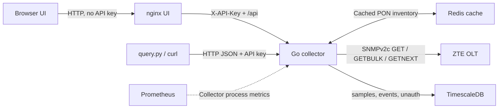

# ZTE C300 Monitoring

Read-only ZTE C300 GPON monitoring for small ISPs and NOC teams: ONU optical
levels, Ethernet port state, stored history, a web dashboard and a JSON API.
It retrieves ONU information on request and uses Redis to cache PON inventories.
It also has an optional history poller and a first React/nginx frontend. The
direction is a standalone PON monitoring and troubleshooting app for NOC staff
and installers, with an API for optional external consumers. The next priority
is authenticated mobile access and fresh optical readings; see the
[roadmap](docs/roadmap.md) and [field workflow](docs/field-use.md).

Maintained by one person in spare time, with contributions welcome. Help with
firmware validation, API consistency, mobile usability and deployment testing
is especially useful. Start with [CONTRIBUTING.md](CONTRIBUTING.md); small fixes
and clear bug reports are welcome too.

**Status: early development preview for controlled trials and contributions.** Automated
and synthetic deployment tests do not prove compatibility with a particular C300
firmware. Compare the first results with the OLT CLI before relying on them.
Existing C320 mappings are retained but are not a separate compatibility guarantee.
Limited hardware observations are documented in
[compatibility observations](docs/compatibility.md); ONU RX and Ethernet state have CLI cross-checks; TX now uses the documented ANI object.
Broader hardware acceptance remains pending.

Derived from the MIT-licensed [snmp-olt-zte](https://github.com/Cepat-Kilat-Teknologi/snmp-olt-zte).
Original attribution and the exact source revision are in [UPSTREAM.md](UPSTREAM.md).
This project is independent of ZTE and the upstream maintainer.

## Preview


Development screenshot; subscriber names and serials are blurred. See the
[full UI gallery](docs/ui.md#screenshots) for inventory, ONU detail, PONs and
poller runs. Some labels predate the latest freshness fixes.

## Start here

| Need | Guide |
|---|---|
| New Debian machine, installation, build, first start | [Debian deployment](docs/deployment.md) |
| Every setting needed for the first OLT, advanced inventory | [Configuration](docs/configuration.md) |
| Every HTTP path, query parameters and history examples | [API catalog](docs/api.md) and [OpenAPI](api/openapi.yaml) |
| Operator dashboard (history) | [UI](docs/ui.md) |
| Compare telemetry against a real device | [Hardware acceptance](docs/hardware-testing.md) |
| What was removed, fixed and still needs work | [Repository review](docs/review.md) |
| NOC/installers, live optics, MAC history | [Roadmap](docs/roadmap.md) |
| Mobile installer workflow and optical freshness | [Field use](docs/field-use.md) |
| Current storage and live/history data paths | [Architecture](docs/architecture.md) |
| Browser authentication and TLS plan | [Edge access](docs/edge-access.md) |
| Public-file and fixture handling | [Publication review](docs/publication-review.md) |

## What it does

- Lists provisioned ONUs on a selected physical slot/PON: name, type, serial,
  operational state and received optical power.
- Retrieves individual ONU details, including transmit power, description,
  reported IP, optical distance and last online/offline information where the
  firmware exposes those fields.
- Optionally writes PON snapshots (identity, state, RX/TX and Ethernet UNI) to
  TimescaleDB on a timer. Each cycle also records status/UNI transitions and
  attempts unconfigured-ONU discovery. Redis remains a disposable cache;
  history is not stored there. Schema upgrades preserve `onu_samples`; version
  3 backfills derived events/state. Back up the database before upgrading.
- Reports ONU Ethernet admin/link state and speed/duplex in detail responses.
  Known ONU types pad missing UNI indexes `1..N`. See
  [ONU telemetry](docs/onu-telemetry.md) for unavailable-data semantics.
- Supports explicit slot/PON layouts, including mixed card sizes (`3:16,5:8`).
- Provides serial lists, pagination, free-ID observations and cache refreshes.
- Discovers uplink interfaces and card descriptions through IF-MIB and ENTITY-MIB.
- Supports a static inventory of multiple OLTs and optional per-user API keys.
- Exposes process health, dependency readiness, build information, structured
  logs and Prometheus metrics about the **collector**.

All OLT operations are SNMP reads. The POST and DELETE API routes operate on the
collector's Redis cache; they do not provision, reboot or reconfigure ONUs.
An observed free ONU ID is not a reservation and can change immediately.

There is currently **no MAC last-seen table, per-ONU traffic collection, phone
field-mode contract, alarm delivery, trap receiver, provisioning or billing
integration**. Unconfigured-ONU discovery is implemented as a candidate SNMP
walk (`GET /history/unauth` and the Unconfigured UI page). A failed or
unconfirmed walk is `unsupported`, never a verified empty network.

Compose serves the operator UI at `http://127.0.0.1:8080`. Inventory, charts and
poller runs read Timescale history. ONU detail can issue **Query now** (one HTTP
request that performs multiple SNMP reads for the selected ONU). That is not yet authenticated mobile field mode. The UI
has no browser login or TLS: keep it on loopback. `/metrics` contains collector
metrics, not per-ONU optical series. External integrations remain optional and
platform-neutral. See [UI](docs/ui.md).

## How it works



The API checks authentication and the configured slot/PON boundaries. A cached
PON list can be served without querying the OLT. A cache miss triggers SNMP reads;
results are cached for the configured TTL. Lists requested near expiry can
trigger an asynchronous refresh. Individual ONU detail and uplink topology
requests query SNMP live. Concurrent identical collection requests are coalesced.

When `POLL_ENABLED=true`, a background loop walks each configured PON in
sequence and stores snapshots in TimescaleDB. This includes PON-scoped Ethernet
collection; it is not just a name-only walk. After each cycle it also derives
status/UNI change events and walks a candidate unconfigured-ONU table. The
poller is read-only and disabled in the public template until one-PON
acceptance and load measurement. HTTP DELETE routes clear Redis only; they
never delete ONUs on the OLT.

Redis is disposable cache, not historical storage. The supplied Redis
deployment does not persist it. TimescaleDB is the durable store and uses a
named volume. Whole-device cache preloading is disabled in the example
configuration. Retention policies are not yet configured: history grows until
explicitly maintained. The current poller/UI need TimescaleDB, and Redis is
wired into API caching/readiness. Both remain in the current architecture;
installer field reads need a separate fresh acquisition path, not removal of
the cache or history store. See [architecture](docs/architecture.md).

## Deployment choice

**Start with Docker Engine and the Compose plugin on Debian 13.** One collector,
one Redis cache, one TimescaleDB instance and the nginx UI fit on one VM. Suggested trial
allocation: 2 vCPUs, 4 GB RAM, 40 GB disk, a management-network route to the OLT
and working DNS/NTP. This is a starting allocation, not a measured capacity
guarantee.

Build an image **once per version**, run the tests, and deploy that tag. Normal
starts and restarts use the existing image. During development you can build on
the VM; once an image release workflow exists, build in CI and pull a tested
image by digest. No public container image is published yet.

| Option | Recommendation |
|---|---|
| Docker Compose | Primary documented deployment; few moving parts for one host |
| Podman | Local container smoke test supports it; Compose/provider and service lifecycle need separate host validation |
| Kubernetes | Later, if an existing cluster provides a real operational benefit; reuse the same image |
| Native Go process | Useful for development; you manage Redis and process supervision yourself |

Kubernetes would add manifests, service routing, secret distribution and probe
configuration without improving telemetry correctness. Do not add replicas
against a shared cache until polling coordination and multi-instance behavior
are tested.

## Get the source

Clone this adapted repository:

```sh
git clone https://github.com/dahnutz/zte-c300-monitoring.git
cd zte-c300-monitoring
```

Use a reviewed release tag or commit for deployment. Cloning the upstream link
above gives the upstream application, without this project's changes. For an
offline source transfer, use the archive procedure in the deployment guide.

## Quick start on a prepared Docker host

Requires Docker Engine, its current Compose plugin, Git, curl and OpenSSL.
See the [full installation guide](docs/deployment.md) if any are missing.

```sh
cp .env.example .env
chmod 600 .env
openssl rand -hex 32
# Edit .env: set SNMP_HOST, SNMP_COMMUNITY, API_KEY, actual OLT_BOARDS,
# OLT_TIMEZONE and a separately generated TIMESCALEDB_PASSWORD.
# Paste the first generated hex value as API_KEY; keep POLL_ENABLED=false.
nano .env

docker compose config --quiet
docker build --target test -t zte-c300-monitoring:tests .
docker compose build collector ui
docker compose pull redis timescaledb
docker compose up -d --no-build --wait
curl --fail http://127.0.0.1:8081/healthz
curl --fail http://127.0.0.1:8081/readyz
```

`up --wait` checks container liveness; the separate readiness request checks Redis
and SNMP, plus TimescaleDB when connected. Readiness is not a check of vendor
OID correctness. First query only one
known PON; use the [API examples](docs/api.md) and [acceptance steps](docs/hardware-testing.md).
The history UI remains empty on a new database while polling is disabled. After
acceptance, set `POLL_ENABLED=true` in `.env` and recreate the collector.

The API is published on `127.0.0.1:8081` and UI on `127.0.0.1:8080`; Redis and
TimescaleDB have no host ports. Use an SSH tunnel
from another computer. SNMPv2c communities travel without encryption: use the
management network or a VPN and a read-only OLT account/ACL for the collector host.

## Development and tests

Native prerequisites: Go 1.26.8, Make, a C compiler for the race detector, and
internet for the first dependency download. A local OLT or Redis is not needed
for unit/integration tests. Use a clean terminal with no live OLT settings exported.

```sh
make check   # formatting, go vet, tests with the race detector
make build   # bin/zte-c300-monitoring
```

Or run the same checks in the Go build container:

```sh
docker build --target test -t zte-c300-monitoring:tests .
```

Test the actual runtime image, Redis and synthetic UDP SNMP fixture:

```sh
# Additional host tools: Bash, curl, Python 3.
./scripts/smoke.sh
# On a Podman development host:
CONTAINER_ENGINE=podman ./scripts/smoke.sh
```

The script builds test images, creates an isolated container network, checks
readiness, authentication, invalid topology rejection, ONU/list/uplink data and
cached data during OLT unavailability, then removes its containers and network.
Images remain available for inspection. It never contacts a real OLT. The fixture
is built into a separate test image and is absent from the production image.

Frontend development requires Node.js 22.18+ and npm:

```sh
cd web
npm ci
npm test
npm run build
cd ..
```

The [contributor guide](CONTRIBUTING.md) explains the local UI proxy and synthetic
tests. [Security policy](SECURITY.md) covers deployment boundaries and reporting.

For native development, supply `.env`, start Redis separately, and use `make run`.
The native listener defaults to localhost. The container build supplies the Go
compiler and system dependencies; these are not needed on a deployment-only host.

## Repository layout

```text
app/                 Service lifecycle, OLT registry and HTTP routes
cmd/api/             Entrypoint and container healthcheck command
config/              Environment, static OLT inventory, slot/PON OID generation
internal/handler/    HTTP request/response handling
internal/store/      TimescaleDB / in-memory history store
internal/poller/     Read-only PON-list scheduler
internal/device/     Vendor/family/role names for later adapters
internal/usecase/    Collection, cache policy and topology interpretation
internal/repository/ Redis and SNMP access
internal/middleware/ Authentication, validation, timeouts and logging
internal/health/     Dependency checks
internal/utils/      Response helpers and inherited value conversions
pkg/                 SNMP connections, Redis client, metrics and lifecycle helpers
api/openapi.yaml     Machine-readable HTTP API contract
test/snmp-fixture/  Synthetic SNMP data for container testing
scripts/query.py      Authenticated GET client for the HTTP API
scripts/smoke.sh      Disposable deployment test
docs/               Installation, configuration, API, hardware tests, review, roadmap
Dockerfile           Test, build, fixture and production image targets
web/                 React frontend and nginx image (HTTP only today)
compose.yaml         Collector + Redis + TimescaleDB + UI deployment
```

Keep `.env`, private captures and real inventory under ignored local paths.
Share only sanitized fixtures. The [review](docs/review.md) and
[roadmap](docs/roadmap.md) record current limitations and the next stages.
License: [MIT](LICENSE).
