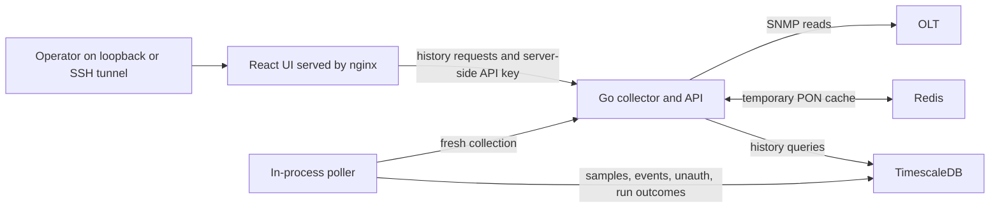

# Architecture and storage decisions

Updated: 20 September 2026. The project remains a standalone PON monitoring and
troubleshooting application for NOC staff and field installers. External
platforms may consume the API; no particular platform is required or designated
as a replacement. [Roadmap](roadmap.md) owns priorities and acceptance criteria.

## Current implementation

Compose starts collector, Redis, TimescaleDB and UI. The nginx configuration has
no browser authentication/TLS yet. Keep current UI/API bindings on loopback
until the [authenticated edge](edge-access.md) is implemented or provided.

PON collection includes inventory, RX/TX and Ethernet UNI. Detail reads scope
Ethernet walks to one ONU; list collection uses three PON-scoped Ethernet columns
and joins rows to known online ONUs. The poller requests fresh data before saving
it, then writes status/UNI transition rows and a candidate unconfigured-ONU list.
Individual detail bypasses Redis. Inventory/history UI pages read Timescale. ONU
detail **Query now** issues that live GET. A history-page reload is not a new
optical measurement.

Timescale schema version 3 is additive: it keeps `onu_samples` and
`collection_runs`, adds columns on `onus`, and creates `onu_status_events`,
`onu_eth_events`, `onu_eth_state` and `onu_unauth*`. Startup migrates existing
volumes without dropping sample history.

## Keep Redis and TimescaleDB

**The current decision is to keep both services and the existing frontend.**
The next work is installer access and trustworthy live optical readings, not a
storage migration or conversion into a temporary adapter for another product.

| Question | Redis today | TimescaleDB today |
|---|---|---|
| Purpose | Short-lived PON/serial/free-ID responses | Timestamped ONU samples, identities and collection runs |
| Lifetime | TTL/eviction; Compose disables persistence | PostgreSQL named volume; survives container replacement |
| Readers | Existing API/usecase cache paths | History API and current UI |
| Is history lost if cleared? | No, but recollection increases SNMP load | Yes, if the durable store is deleted |
| Current dependency | Wired into API/cache readiness | Required by current poller and history UI |

They contain some overlapping recent values but have different responsibilities.
Redis supplies inventory cache; it must not silently satisfy a request labelled
as a fresh field measurement. Timescale preserves observations for history; an
old row is not the current optical level. Both can remain useful while a new live
view reads a specific ONU directly through the collector.

The schema/migrations use the Timescale extension and hypertables. Plain
PostgreSQL is not a supported drop-in substitute. Automatic retention is not
configured yet; implement sample/run retention, database-size monitoring and
restore testing before sustained operation. A later simplification should be
based on actual load and maintenance needs, with migration tests—not assumed
because an external platform might eventually read the API.

## Two explicit observation paths

| View | Intended source | Freshness presented to user |
|---|---|---|
| NOC inventory/history | Cached inventory or stored samples | Source, collection time, age and completeness |
| ONU detail Query now | On-demand SNMP reads for one ONU | Collector `observed_at`; not per-field optical age |
| Installer field mode (planned) | Fresh SNMP read for the selected ONU | Reading start/end, per-field success/age and explicit live/stale state |

Field mode must never fall back from a failed fresh read to history while keeping
its “live” label. A previous good value can remain as a clearly marked last-known
reading. Optical reads need their own collection metadata; the current Ethernet
`observed_at` is not a timestamp for RX/TX. See [field workflow](field-use.md).

A successful SNMP request establishes what the OLT returned at that time. It
does not prove the OLT refreshed its own optical sensor/remote-ONU cache at that
instant. Validate device refresh delay and units before promising a cadence.
Unavailable remote readings during fiber loss must stay unavailable, not zero
or an old value. This is remote telemetry, not a substitute for a field power
meter where the ONU cannot report.

## Mobile access path (planned)

A mobile browser reaches the authenticated HTTPS application. Only the collector
reaches the OLT management network; phones never receive SNMP credentials or the
collector's server API key. Operators can use a managed VPN or an appropriately
protected application edge, depending on deployment policy. Opening raw UI/API
ports is not a substitute for that edge.

Use named read-only installer accounts, revocation and a deliberately approved
network scope. Basic Auth can guard a common view; it cannot create per-OLT
permissions by itself. If account scopes differ, enforce them server-side on
both list and live-read paths before granting that access.

## Platform-neutral API

Keep versioned HTTP JSON and OpenAPI as the integration boundary. Consumers
should receive stable device/ONU identity, timestamps, source, completeness and
unavailable/error semantics without depending on the frontend or database schema.
Use separate integration credentials and bounded snapshot reads; a dashboard or
external client's item fan-out must not trigger a fresh SNMP walk per metric.

Live acquisition is explicit and rate-limited. Multiple authorized viewers of
the same ONU can share an in-flight read, with its true collection time retained.
It must still be distinguishable from a previously cached result. Full snapshot,
optical-freshness and integration contracts need implementation/acceptance; the
existing routes are not automatically proof of those properties.

## Operational boundaries

- Keep application containers replaceable while preserving required configuration
  and history. No requirement exists to discard data or retire this app.
- Keep device access read-only; no provisioning, reset or port toggles in installer
  mode. Cache-management routes are also outside installer permissions.
- Coordinate field reads with background polling under one per-OLT budget.
  Prefer responsive, bounded selected-ONU reads without flooding the management CPU.
- Pause field refresh when the page is hidden, the network is lost or the session
  ends; a abandoned mobile tab must not create endless background collection.
- Back up durable state and verify schema restore before upgrades. Do not remove
  database volumes as a shortcut to simplifying deployment.
