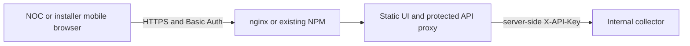

# Authenticated frontend and HTTPS

## Current state

The frontend already exists in `web/`: React is built into static files and an
unprivileged nginx container serves them. Nginx injects the collector API key
for `/api/`. It currently has **no browser authentication or TLS** and forwards
more API routes than the UI uses. API keys authenticate the proxy's calls, not
the browser user. Keep both published app ports on loopback or use SSH tunnels.

This document is the proposed shared-access design. No edge service, password
file or TLS certificate is created by following the current Compose quick start.

## Recommendation

**Use named accounts over HTTPS for NOC staff and installers on mobile devices.**
Nginx Basic Auth is an initial option when those users share an approved
read-only network view. Extend the existing nginx frontend, or reuse an existing
edge proxy. If users need different OLT/PON permissions, add server-side scope
enforcement before granting that access; Basic Auth alone cannot provide it.
Nginx supports [Basic Auth with a password file](https://nginx.org/en/docs/http/ngx_http_auth_basic_module.html)
and [HTTPS termination](https://nginx.org/en/docs/http/configuring_https_servers.html).

| Choice | When it fits | Operational responsibility |
|---|---|---|
| Existing UI nginx, with Basic Auth/TLS added | One small deployment; recommended baseline | Versioned config, mounted hashed passwords/certificates, renewal and reload automation |
| Existing nginx edge in front of UI | Team already operates an edge proxy | Reuse certificate/auth lifecycle; keep UI/API inaccessible around the proxy |
| Nginx Proxy Manager (NPM) | Team wants GUI-managed proxy hosts and certificates, especially if already installed | Protect its separate admin interface and persistent proxy/certificate configuration |

NPM provides access lists/Basic Auth and Let's Encrypt or custom certificates.
It is an alternative edge, not an app dependency. Its administration login does
not protect a proxy host by itself: attach the access list to the actual host.
Use password-required policy; an address allow rule must not accidentally bypass
it through “satisfy any”. [NPM features](https://nginxproxymanager.com/guide/).

If NPM runs in another container, `127.0.0.1` refers to that container. Connect
it to a deliberately shared private network with the UI, or use a controlled
host path. Do not bind all app ports to `0.0.0.0` merely to make proxying work.

## Target request path

For standalone nginx, Edge and UI are the same container. With an existing
external proxy, they are separate; only the authenticated edge is reachable by
operators. Certificates/private keys and the password file are mounted from
private configuration, never baked into images or committed.

## Required behavior before enabling shared access

1. Protect the whole operator surface: static pages, `/api/`, `/version` and
   `/readyz`. Keep health/metrics checks internal; a healthcheck exception must
   not become an unauthenticated path to the collector.
2. Use Basic Auth only over TLS. Have a certificate issuance/renewal owner and
   a reload check; internal CA or private DNS validation may suit a VPN-only host.
3. Give each operator a named account, store password hashes in a mounted file,
   and record username/request metadata without passwords, keys or payloads.
4. Never accept a browser-supplied `X-API-Key` as a substitute for edge login.
   Replace it at the trusted proxy. Strip Basic credentials before forwarding
   where they are not needed; the collector uses a separate header. NPM notes
   possible conflicts with upstream apps that also use `Authorization`:
   [authentication FAQ](https://nginxproxymanager.com/faq/).
5. Restrict installer routes/methods to approved lookup/history and bounded
   selected-ONU live readings. The current template forwards the complete API
   with the server's shared key: block cache mutations, bulk exports and unrelated
   administrative paths for field accounts. Test direct URLs as well as UI links.
6. The current proxy uses one API key for all browser users. Named Basic Auth
   accounts do not change that. Define whether installers may see the same
   network; if scopes differ, map trusted identity/credentials to permissions
   and enforce them in the backend on both history and live-read routes.
7. Confirm unprotected UI/API ports cannot be reached via LAN, container network
   peers outside the trusted scope or another ingress. A second open route defeats
   Basic Auth. Limit exposed services to the intended management network.

## Field-device access and lifecycle

Phones connect to the HTTPS application only; the collector retains the route
to OLT management. Choose a mobile VPN or a deliberately exposed authenticated
application edge according to deployment policy. Do not expose raw collector,
Redis or database listeners, and do not require installers to bypass certificate
warnings. Test certificate trust/renewal on the actual managed phones.

Use one revocable account per person, not a crew-wide password. Basic Auth has
browser credential caching and limited logout control; test lost-device/account
revocation. If reliable session expiry, MFA or finer roles become necessary,
use an established identity proxy rather than building a custom identity system.
No such identity/session layer is currently bundled.

Live refresh needs per-user/OLT budgets and a finite active-session lifetime
alongside authentication. Protect against abandoned tabs and concurrent phones
creating uncontrolled SNMP work. See [field workflow](field-use.md).

## Acceptance checklist

- No/malformed/incorrect credentials denied on pages **and API paths**.
- Valid user can load the UI; the API key is absent from browser assets/storage.
- HTTPS trust, renewal, expiry monitoring and reload are verified.
- Unsupported methods/live routes denied on the browser proxy as designed.
- Direct collector/UI bypass blocked; health probes still work internally.
- Named-user removal takes effect on subsequent requests, and any active refresh
  session is revoked/expired; access logs omit credentials and subscriber data.
- iOS/Android login, trusted certificates, mobile network changes, screen locking
  and reconnection are tested. No cached observation regains a live label merely
  because the phone reconnects.
- Installer read-only scope holds for direct API requests; server API keys and
  SNMP communities never reach browser assets or storage.
- Basic Auth's browser credential caching/logout limitations are documented.

These are release gates. They are not a claim that the current nginx template
already passes them. Authentication/TLS implementation is the next P0 task.
