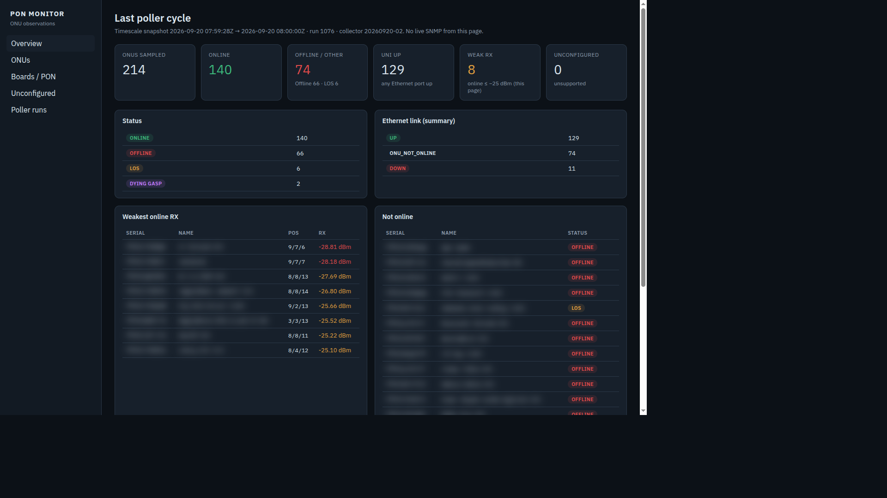
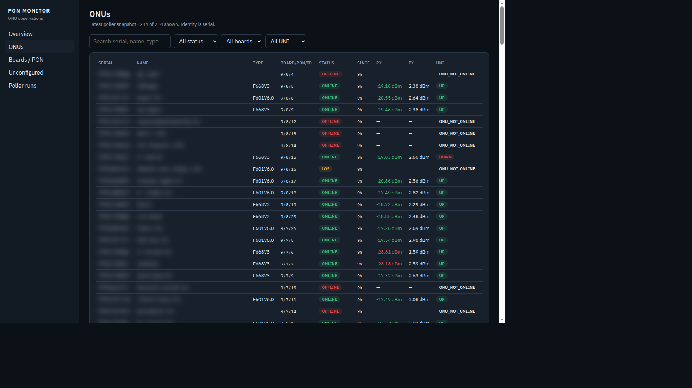
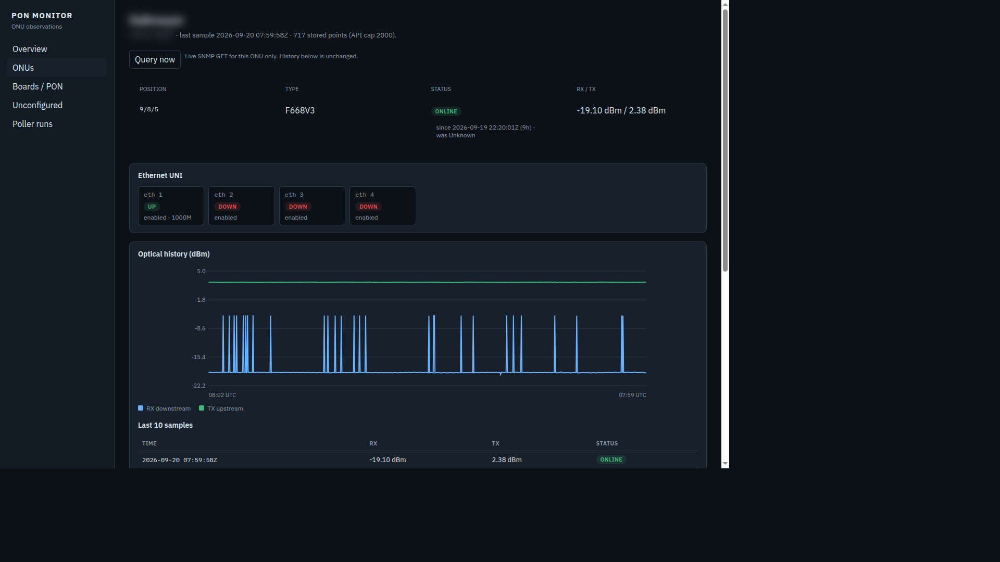
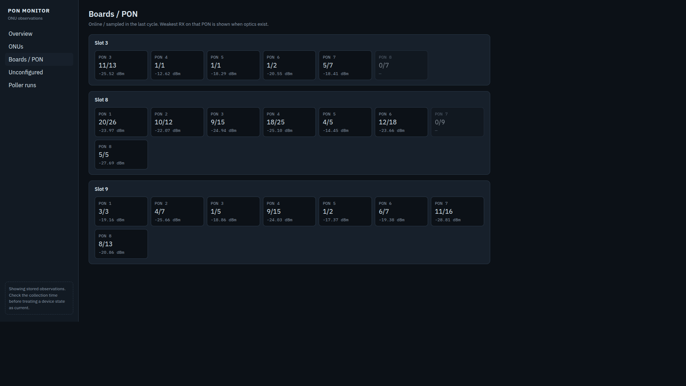
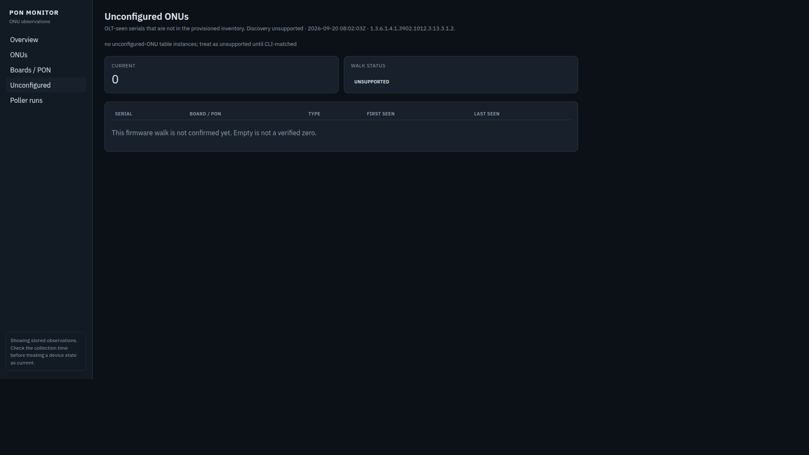
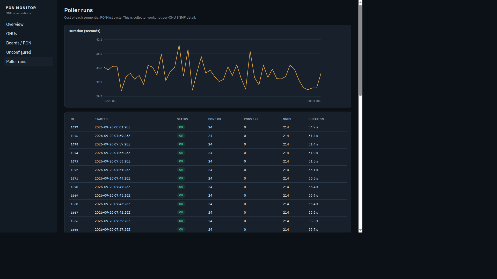

# Operator frontend

## What exists today

`web/` contains a React/TypeScript frontend served by the Compose `ui` nginx
container. Inventory, overview, PON map and poller-run pages read stored
TimescaleDB observations. ONU detail can additionally call the live ONU GET
(**Query now**). The Unconfigured page reads `/history/unauth` (last poller
discovery). The proxy forwards GET/HEAD requests under `/api/`; other methods are blocked. Nginx attaches the
collector key server-side; browser assets do not contain it.

The listener is `127.0.0.1:${UI_PORT:-8080}`. It has **no browser login or TLS**.
Use loopback/SSH tunnelling today; [edge access](edge-access.md) defines the
named-user HTTPS access required for NOC staff and mobile installers. Basic
Auth is the initial option for a common approved read-only scope. Existing Nginx
Proxy Manager may provide that boundary externally; it is not bundled here.

From a prepared Docker host after configuring `.env`:

```sh
docker compose build collector ui
docker compose pull redis timescaledb
docker compose up -d --no-build --wait
```

A new database has no observations while `POLL_ENABLED=false` (the public
default). Complete [hardware acceptance](hardware-testing.md), then explicitly
enable polling and recreate the collector to populate history. A custom native
API-only deployment does not supply data for these history pages.

## Current pages

| Page | Data | Purpose |
|---|---|---|
| Overview | History rows/counts | State summary, UNI state and basic optical highlighting |
| ONUs | Selected stored collection run | Search/filter identity, type, slot and UNI |
| ONU detail | Serial-filtered samples + optional live GET | RX/TX plot, last 10 samples, status since, UNI ports and flap history, Query now |
| Boards / PON | Selected stored collection run | Observed occupancy and optical values |
| Unconfigured | `/history/unauth` | OLT-seen serials that are not provisioned |
| Poller runs | `/history/runs` | Cycle duration and reported PON errors |

## Screenshots

These screenshots show the development UI with subscriber names and serial
numbers blurred. Hardware model names, slot/PON positions, counts and optical
readings are intentionally retained with operator approval to show the app in use.

The captures predate the latest freshness fixes, so some labels differ from the
current build. In particular, unsupported discovery is unknown, even where an
older screenshot displays a zero count. Query now makes one HTTP request that
performs several SNMP reads; it is not a continuous live stream.

### Overview

Stored collection summary, ONU and Ethernet states, and weakest optical readings.



### ONUs

Searchable inventory with operational state, optical levels and Ethernet status.



### ONU detail

On-demand collection, Ethernet UNI ports and stored RX/TX history.



### Boards / PON

Observed ONU occupancy and optical readings grouped by slot and PON.



### Unconfigured ONUs

Discovery results and whether the firmware's candidate table is supported.



### Poller runs

Collection duration, sampled ONU counts and PON errors.



## Current limitations

- Pages use the default OLT routes; there is no multi-OLT selector even though
  the API supports explicit OLT IDs.
- Inventory uses the newest finished run among the latest 20 runs, including a
  partial/failed run. It never substitutes an older larger inventory. With no
  finished run in that window, it shows no current inventory.
- Overview, ONUs and PON pages show the run timestamp, row count and PON errors.
  They warn on partial/limited results. The 2000-row cap remains; full pagination
  and an atomic snapshot contract are pending. Pages are separate reads and do
  not auto-refresh. Missing rows do not establish device disappearance.
- There is no persistent alarm state. Fixed optical colour thresholds are
  display hints, not validated per-service optical acceptance policies.
- Poll interval is not guaranteed observation freshness. A stalled/partial run
  or failed OLT must be visible before its rows can be trusted as current.
- The proxy shares one API key across browser users. Future Basic Auth protects
  access but does not map those users to API roles/OLT ownership.
- **Query now** is one HTTP request with multiple SNMP reads. It checks the
  returned serial/position, discards reads after navigation and clears previous
  values before retrying. Collection time is not the OLT sensor timestamp. It does not implement the [field-mode](field-use.md)
  freshness contract (per-field optical age, bounded auto-refresh, phone layout).
- Unconfigured discovery is a candidate walk. `unsupported` is not a verified
  zero. Confirm against CLI before treating the table as complete.

## Next frontend work: installers on mobile devices

Priorities are in the [roadmap](roadmap.md) and the detailed
[field workflow](field-use.md):

1. Named-account HTTPS access and an approved read-only network scope.
2. Responsive ONU/PON lookup and explicit OLT selection on a phone.
3. Expand **Query now** into field mode: large dBm readings, direction, ONU/UNI
   state, collection time and per-field age (the current button is a live GET
   only).
4. Optional bounded auto-refresh only while field mode is active; pause on page
   hide/network loss, discard responses for previously selected targets and show
   failed/stale values explicitly.
5. Add complete pagination and coordinated snapshots; keep history visibly separate.

The existing detail API is a starting point, but a history-page reload cannot
satisfy field mode. Reading age and per-field availability require API work too.
Do not clear the shared cache or poll every PON just to refresh one installer view.

Keep current history/charts for troubleshooting. Unconfigured-ONU discovery is
on `/unauth`; treat `unsupported` as unverified. MAC lookup remains planned.
External platforms may use the API; none is required to use this application.
